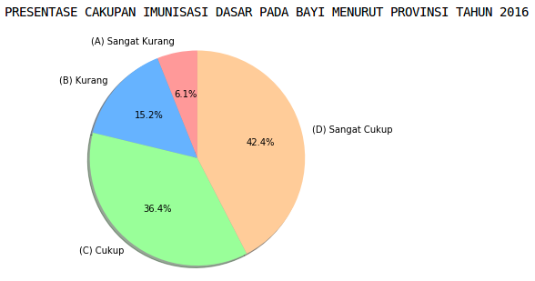

# DatScience
> My Data Science Exercise

This project is for upgrading my skillset in data science. It was created with popular data science library in python universe including scikit, matplotlib, pandas, etc. 

Some of implementations:
- KMean Clustering of Vaccinate Data in All Provinces of Indonesia

## KMean Clustering of Vaccinate Data in All Provinces of Indonesia
- The raw data is from public health Office of Indonesia year 2016 

- The provinces are clustered into 4 cluster

- Each total of cluster is visualized using pie chart

